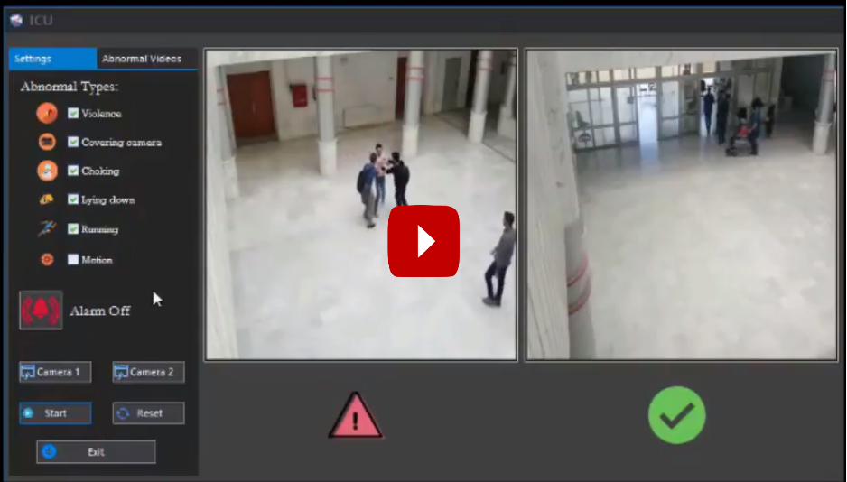

# Real-Time-Abnormal-Event-Detection-And-Tracking-In-Video
The main abnormal behaviors that this project can detect are: Violence, covering camera, Choking, lying down, Running, Motion in restricted areas. It provides much flexibility by allowing users to choose the abnormal behaviors they want to be detected and keeps track of every abnormal event to be reviewed. We used three methods to detect abnormal behaviors: Motion influence map, Pattern recognition models, State event model. For multi-camera tracking, we combined a single camera tracking algorithm with a spatial based algorithm.

<h1>Requirements</h1>
Emgu  
Telerik  
Accord  
Accord.MachineLearning  
Accord.Math  
MediaToolkit  
Newtonsoft.Json  
 
 

<h1>System Implementation</h1>

Following Class diagram of the system:

  <h3>1- Motion Influence Map </h3>
  <h4>Introduction</h4> 
Initially, Suspicious movement is divided into two parts, internal and external. The internal occurs in a small area of the scene such as a sudden appearance of an object (such as a bicycle or car) in an area where people are naturally present, or the rapid movement of a person while the rest of the people move slowly. On the whole, the external situation occurs as many people suddenly flee together.

The diagram illustrates the general framework of the proposed system. By entering a series of scenes, motion information is calculated at the pixel and mass level sequentially. The kinetic energy of each block is then calculated to construct the structure of the motion effect (Motion Influence Map).
The proposed structure represents both temporal and spatial properties within the attribute array.
To classify the natural event of suspicious we will apply K-means algorithm to determine the centers of natural events in the scene, then we can deduce the suspicious event by applying Euclidean distance law between the monitored scene and the centers of scenes, if it exceeds a certain threshold will be considered suspicious scene.

  <h4>Algorithm Steps</h4>
  1- Motion Descriptor:
we estimate the motion information indirectly
from the optical flows. Specifically, after computing
the optical flows for every pixel within a frame, we
partition the frame into M by N uniform blocks without
a loss of generality, where the blocks can be indexed by
{B1, B2, ... , BMN}, and then compute a representative optical
flow for each block by taking the average of the optical flows of the pixels within the block.
 

2- Motion Influence Map:
The direction of pedestrian movement within the crowd can be affected by several factors such as obstacles on the road, neighboring pedestrians and moving vehicles. This characteristic reaction is called the motion effect.
We consider that the mass is under the influence of another moving object that will be determined by two factors: the direction of movement and the speed of movement. The faster the object moves, the greater the number of adjacent blocks affected by its movement. Nearby blocks are more affected than remote blocks.
After calculating the effect weights for all the blocks we can build Motion Influence Map express patterns of motion effect within the scene.
After calculating the impact weights that are only calculated between two blocks we will calculate the beam of motion weights for each block within the scene where we will take all the impact blocks into account.

 
The previous diagram briefly illustrates the stages of Motion Influence Map algorithm : 
A- Optical flow. 
B- calculate the impact of movement between the blocks. 
C- Calculate the effect weights between each two blocks. 
D- Calculate the beam weights of impact for each block. 
 

3- Feature Extraction:
After we have built motion influence map of the scene, we can find the mass that contains a suspicious event where it has a characteristic motion beam. But the activity is tracked through several consecutive scenes so we will extract the beam of attributes for each of the adjacent blocks through a certain number of scenes together mega block.
Thus each scene will be divided into a group of mega blocks each containing the motion effect
Finally we extract the temporal and spatial features of each mega block for a number of blocks within the scene
By collecting the rays of the movement effect within each scene separately. 

 

4- Detection, and Localization:
For each mega block, we then perform K-means clustering using the spatio-temporal features, Here, we should note that in our
training stage, we use only video clips of normal activities. Therefore, the codewords of a mega block model the patterns
of usual activities that can occur in the respective area.
 
 

<h3> 2- Pattern Recognition and State Event Model </h3>
  <h4>Steps</h4>
1- Corner Detector: Apply "Good Features to track" algorithm

 
2- Lucas-Kanade Optical Flow: On the extracted corners.

 
3- Classification
 
<h4>This project is based on the following papers:<h4>
 
https://ieeexplore.ieee.org/document/7024902?section=abstract
https://www.researchgate.net/publication/221362278_Anomaly_Detection_in_Crowded_Scenes
https://www.researchgate.net/publication/220278263_Motion-based_unusual_event_detection_in_human_crowds

  

  

